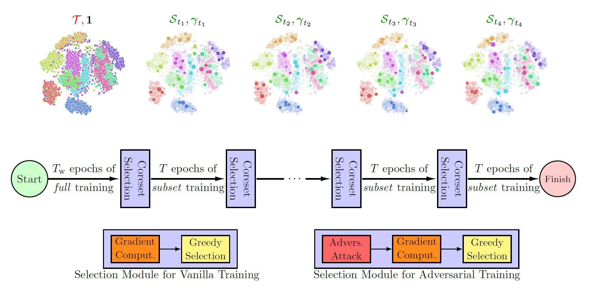

# Adversarial Coreset Selection

*Hadi M. Dolatabadi, Sarah Erfani, and Christopher Leckie 2022*

[](https://arxiv.org/abs/2112.00378)
[](https://opensource.org/licenses/MIT)

This repository contains the official implementation of the ECCV 2022 paper $\ell_\infty$-[_Robustness and Beyond: Unleashing Efficient Adversarial Training_](https://arxiv.org/abs/2112.00378).

<p align="center">
  
</p>

Abstract: *Neural networks are vulnerable to adversarial attacks: adding well-crafted, imperceptible perturbations to their input can modify their output. Adversarial training is one of the most effective approaches in training robust models against such attacks. However, it is much slower than vanilla training of neural networks since it needs to construct adversarial examples for the entire training data at every iteration, hampering its effectiveness. Recently, _Fast Adversarial Training_ (FAT) was proposed that can obtain robust models efficiently. However, the reasons behind its success are not fully understood, and more importantly, it can only train robust models for $\ell_\infty$-bounded attacks as it uses FGSM during training. In this paper, by leveraging the theory of coreset selection, we show how selecting a small subset of training data provides a _general_, more principled approach toward reducing the time complexity of robust training. Unlike existing methods, our approach can be adapted to a wide variety of training objectives, including TRADES, $\ell_p$-PGD, and Perceptual Adversarial Training (PAT). Our experimental results indicate that our approach speeds up adversarial training by 2-3 times while experiencing a slight reduction in the clean and robust accuracy.*

## Requirements

To install requirements:

```setup
pip install -r requirements.txt
```

## Repository Structure

| Path | Description
| :--- | :----------
| master | The main folder containing the repository.
| &ensp;&ensp;&boxvr;&nbsp; [configs]() | Config files containing the settings.
| &ensp;&ensp;&boxvr;&nbsp; [cords]() | Coreset selection modules.
| &ensp;&ensp;&boxvr;&nbsp; [misc]() | Miscellaneous files.
| &ensp;&ensp;&boxvr;&nbsp; [perceptual_advex]() | Perceptual adversarial training modules.
| &ensp;&ensp;&boxur;&nbsp; [scripts]() | Training scripts for different adversarial training objectives.
| &ensp;&ensp;&ensp;&ensp;&boxvr;&nbsp; robust_train_FPAT.py | Perceptual adversarial training (CIFAR-10 and ImageNet-12).
| &ensp;&ensp;&ensp;&ensp;&boxvr;&nbsp; robust_train_l2.py | $\ell_2$-PGD adversarial training (SVHN).
| &ensp;&ensp;&ensp;&ensp;&boxvr;&nbsp; robust_train_linf.py | $\ell_\infty$-PGD adversarial training (CIFAR-10).
| &ensp;&ensp;&ensp;&ensp;&boxur;&nbsp; robust_train_TRADES.py | TRADES adversarial training (CIFAR-10).
| &ensp;&ensp;&boxvr;&nbsp; run_train_FPAT.py | Runner module for perceptual adversarial training.
| &ensp;&ensp;&boxvr;&nbsp; run_train_l2.py | Runner module for $\ell_2$-PGD adversarial training.
| &ensp;&ensp;&boxvr;&nbsp; run_train_linf.py | Runner module for $\ell_\infty$-PGD adversarial training.
| &ensp;&ensp;&boxur;&nbsp; run_train_TRADES.py | Runner module for TRADES adversarial training.

## Efficient Adversarial Training with Coreset Selection

To train a robust neural network using coreset selection, first, decide the training objective (here, we provide the code for $\ell_2$ and $\ell_\infty$-PGD, Perceptual and TRADES adversarial training). Once decided, different versions of coreset selection can be used to enable fast, robust learning. In this repository, we provide support for different variants of [CRAIG]() and [GradMatch]() as in the [official cords repository](). Namely, we provide the **ADVERSARIAL** versions of the following coreset selection methods:

| Command | Method Description
| :--- | :----------
| CRAIG | The plain CRAIG method.
| CRAIGPB | The batch-wise version of the CRAIG method.
| CRAIG-Warm | The CRAIG method with warm-start.
| CRAIGPB-Warm | The batch-wise version of the CRAIG method with warm-start.
| GradMatch | The plain GradMatch method.
| GradMatchPB | The batch-wise version of the GradMatch method.
| GradMatch-Warm | The GradMatch method with warm-start.
| GradMatchPB-Warm | The batch-wise version of the GradMatch method with warm-start.

To train a model, we need to run:

```train
python run_train_<OBJ>.py \
        --dataset <DATASET> \
        --cnfg_dir <CONFIG_FILE> \
        --ckpt_dir <CHECKPOINT_PATH> \
        --attack_type <ATTACK> \
        --epsilon <ATTACK_EPS> \
        --alpha <ATTACK_STEP> \
        --attack_iters <ITERS> \
        --lr <LEARNING_RATE> \
        --epochs <NUM_EPOCHS> \
        --frac <CORESET_SIZE> \
        --freq <SELECTION_FREQ> \
        --kappa <WARM_START_FACTOR>
```
where the parameters' definition is given below:
| Command | Method Description
| :--- | :----------
| ```OBJ``` | Training objective (from `[FPAT, l2, linf, TRADES]`).
| ```DATASET``` | Training dataset (currently, each objective can be run on certain datasets only).
| ```CONFIG_FILE``` | Configuration file (a few examples are given in `./configs` folder.)
| ```CHECKPOINT_PATH``` | The save\load path for the trained model.
| ```ATTACK``` | Attack type for coreset construction.
| ```ATTACK_EPS``` | Maximum perturbation norm.
| ```ATTACK_STEP``` | The step-size of attack generation steps.
| ```ITERS``` | Total number of iterations for attack generation.
| ```LEARNING_RATE``` | The classifier learning rate.
| ```NUM_EPOCHS``` | Total number of epochs.
| ```CORESET_SIZE``` | The size of the coreset ($0 \leq c \leq 1$).
| ```SELECTION_FREQ``` | Frequency of coreset selection (in epochs).
| ```WARM_START_FACTOR``` | The warm-start factor.

For instance, let us say we want to run $\ell_\infty$ adversarial training with the `batch-wise version of the GradMatch method with warm-start.` Also, assume that we want to gain a 2x training time gain. We set the coreset size ($c$) to 50% (half of the data will be _actively_ used for training.) We want an update frequency of 20 epochs for coresets, and set the $\kappa$ factor to 0.5. This factor determines the number of warm-start epochs with a relationship of $T_{\rm w} = \mathrm{round}(c \cdot \mathrm{int}(\kappa \cdot E))$. To run this training objective, we run:

```train
python run_train_linf.py \
        --dataset cifar10 \
        --cnfg_dir configs/config_gradmatchpb-warm_cifar10_robust.py \
        --ckpt_dir /GradMatch_Example/ \
        --attack_type PGD \
        --epsilon 8 \
        --alpha 1.25 \
        --attack_iters 10 \
        --lr 0.01 \
        --epochs 120 \
        --frac 0.5 \
        --freq 20 \
        --kappa 0.5
```

## Full Adversarial Training

To provide a ground for **FAIR COMPARISON**, this repository would allow adversarial training with the entire training data as well. To this end, one just needs to set the `type` of the `dss_strategy` in their config to `Full` (e.g., see the `./configs/config_full_cifar10_robust.py` config for an example.) For instance, the previous training comman can be changed to the below one in this case:
```train
python run_train_linf.py \
        --dataset cifar10 \
        --cnfg_dir configs/config_full_cifar10_robust.py \
        --ckpt_dir /GradMatch_Example/ \
        --attack_type PGD \
        --epsilon 8 \
        --alpha 1.25 \
        --attack_iters 10 \
        --lr 0.01 \
        --epochs 120 \
        --frac 0.5 \
        --freq 20 \
        --kappa 0.5
```

## Results

The primary results of this work are given in the table below. Note that the running time heavily depends on the GPU device and the exact versions of each software. Hence, we recommend consistently running the code from scratch to compare training efficiency.

<p align="center">
    <em>Table: Clean (ACC) and robust (RACC) accuracy, and total training time (T) of different adversarial training methods.
        All the hyper-parameters were kept the same as full training for each objective.
        In each case, we evaluate the robust accuracy using an attack with similar attributes as the training objective.
        More detail can be found in the paper.
        The results are averaged over 5 runs.</em>
</p>
<table style="width:750px" align="center">
<tbody>
<tr class="odd">
<th style="text-align:left" rowspan="2">Objective</th>
<th style="text-align:center" rowspan="2">Data</th>
<th style="text-align:center" rowspan="2">Training</th>
<th style="text-align:center" colspan="3">Performance Measures</th>
</tr>
<tr class="even">
<th style="text-align:center">ACC (%)</th>
<th style="text-align:center">RACC (%)</th>
<th style="text-align:center">T (mins)</th>
</tr>
<tr class="odd">
<th style="text-align:left" rowspan="3">TRADES</th>
<th style="text-align:center" rowspan="3">CIFAR-10</th>
<td style="text-align:center">Adv. CRAIG (Ours)</td>
<td style="text-align:center">83.03</td>
<td style="text-align:center">41.45</td>
<td style="text-align:center">179.20</td>
</tr>
<tr class="even">
<td style="text-align:center">Adv. GradMatch (Ours)</td>
<td style="text-align:center">83.07</td>
<td style="text-align:center">41.52</td>
<td style="text-align:center">178.73</td>
</tr>
<tr class="odd">
<td style="text-align:center">Full Adv. Training</td>
<td style="text-align:center">85.41</td>
<td style="text-align:center">44.19</td>
<td style="text-align:center">344.29</td>
</tr>
<tr class="even">
<th style="text-align:left" rowspan="3">$\ell_\infty$-PGD</th>
<th style="text-align:center" rowspan="3">CIFAR-10</th>
<td style="text-align:center">Adv. CRAIG (Ours)</td>
<td style="text-align:center">80.37</td>
<td style="text-align:center">45.07</td>
<td style="text-align:center">148.01</td>
</tr>
<tr class="odd">
<td style="text-align:center">Adv. GradMatch (Ours)</td>
<td style="text-align:center">80.67</td>
<td style="text-align:center">45.23</td>
<td style="text-align:center">148.03</td>
</tr>
<tr class="even">
<td style="text-align:center">Full Adv. Training</td>
<td style="text-align:center">83.14</td>
<td style="text-align:center">41.39</td>
<td style="text-align:center">292.87</td>
</tr>
</tr>
<tr class="odd">
<th style="text-align:left" rowspan="3">$\ell_2$-PGD</th>
<th style="text-align:center" rowspan="3">SVHN</th>
<td style="text-align:center">Adv. CRAIG (Ours)</td>
<td style="text-align:center">95.42</td>
<td style="text-align:center">49.68</td>
<td style="text-align:center">130.04</td>
</tr>
<tr class="even">
<td style="text-align:center">Adv. GradMatch (Ours)</td>
<td style="text-align:center">95.57</td>
<td style="text-align:center">50.41</td>
<td style="text-align:center">125.53</td>
</tr>
<tr class="odd">
<td style="text-align:center">Full Adv. Training</td>
<td style="text-align:center">95.32</td>
<td style="text-align:center">53.02</td>
<td style="text-align:center">389.46</td>
</tr>
</tbody>
</table>


## Acknowledgement

This repository is mainly built upon an older version of [CORDS, COResets and Data Subset selection](https://github.com/decile-team/cords) and [Perceptual Adversarial Robustness](https://github.com/cassidylaidlaw/perceptual-advex).
We thank the authors of these two repositories.

## Citation

If you have found our code or paper beneficial to your research, please consider citing it as:
```bash
@inproceedings{dolatabadi2022unleashing,
  title={$\ell_\infty$-Robustness and Beyond: Unleashing Efficient Adversarial Training},
  author={Hadi Mohaghegh Dolatabadi and Sarah Erfani and Christopher Leckie},
  booktitle = {Proceedings of the European Conference on Computer Vision ({ECCV})},
  year={2022}
}
```